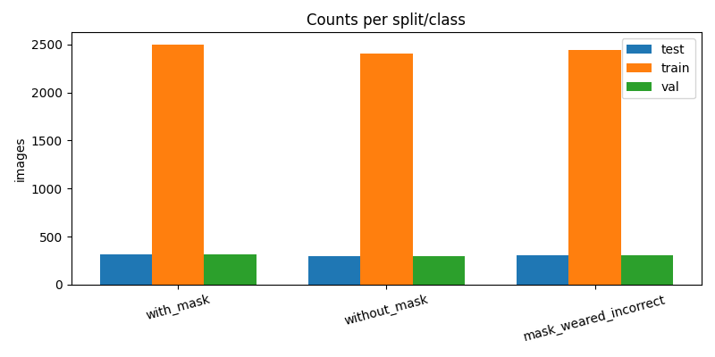
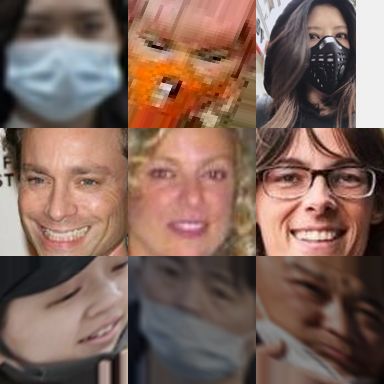

Mask Detector
=============

Overview
--------
This project provides a simple, real‑time face mask detector built with OpenCV and a Keras model. It opens your default webcam, detects faces using a Haar Cascade, and classifies each detected face into three categories:

- `with_mask`: Mask worn correctly
- `without_mask`: No mask
- `mask_weared_incorrect`: Mask worn incorrectly

For each face, the app overlays a color‑coded rectangle and a label showing the predicted class and the confidence percentage.

What's Included
---------------
- `mask_detector.py`: Main script for webcam capture, face detection, and classification.
- `my_mask_detector_1.model`: Trained Keras model for mask classification.
- `haarcascade_frontalface_alt2.xml`: Haar Cascade data file (OpenCV also ships this internally).
- `requirements.txt`: Pinned dependencies for reproducible setup.

Prerequisites
-------------
- Python 3.10 (recommended; the requirements are pinned for this version)
- A working webcam
- macOS, Linux, or Windows with the ability to access the camera

Installation
------------
1) Create and activate a virtual environment (optional, but recommended):

- macOS/Linux:

```
python3 -m venv venv
source venv/bin/activate
```

- Windows (PowerShell):

```
python -m venv venv
venv\Scripts\Activate.ps1
```

2) Install dependencies:

```
pip install -r requirements.txt
```

3) Ensure the model file exists:

- Confirm `my_mask_detector_1.model` is present in the project root. If you plan to use a differently named or located file, update the path in `mask_detector.py` accordingly.

Running
-------
Start the webcam detector:

```
python mask_detector.py
```

Controls and Output
-------------------
- Press `q` to quit.
- The window titled `Video` shows your webcam feed.
- Each detected face displays:
  - A label (e.g., `Mask Worn Properly`, `No Mask!`, `Wear Mask Properly!`).
  - A confidence percentage for the predicted class.
  - A rectangle whose color indicates the status:
    - Green: properly worn mask
    - Red: no mask
    - Orange: mask worn incorrectly

How It Works
------------
- Face detection is performed using OpenCV's Haar Cascade (`haarcascade_frontalface_alt2.xml`). The script resolves the cascade path via `cv2.data.haarcascades`, which uses the copy shipped with OpenCV.
- Each detected face is cropped, converted to RGB, resized to `224x224`, and preprocessed using `MobileNetV2`'s `preprocess_input`.
- Faces are batched and passed to the Keras model (`my_mask_detector_1.model`) to reduce per‑face overhead.
- The model outputs three probabilities in the order `[mask_weared_incorrect, with_mask, without_mask]`. The script chooses the highest probability to determine the label and color.

Configuration Tips
------------------
- Camera index: If you have multiple cameras, change `cv2.VideoCapture(0)` to another index (e.g., `1`).
- Detection sensitivity: You can tune `scaleFactor`, `minNeighbors`, and `minSize` in `detectMultiScale` to trade off recall vs. precision.
- Model path: Update the line `model = load_model("my_mask_detector_1.model")` if your model file is elsewhere or named differently.

Troubleshooting
---------------
- No window appears:
  - Verify that a webcam is connected and accessible.
  - Try another index in `cv2.VideoCapture(...)`.
- Import or dependency errors:
  - Re‑create your virtual environment and re‑install `requirements.txt`.
  - Confirm your Python version matches the pinned dependency versions.
- Cascade not found:
  - The script uses `cv2.data.haarcascades` to locate OpenCV’s built‑in cascades. Ensure your OpenCV install is complete.
- Model load failure:
  - Check the file path and permissions for `my_mask_detector_1.model`.

Project Structure
-----------------
```
.
├── mask_detector.py
├── my_mask_detector_1.model
├── haarcascade_frontalface_alt2.xml
├── requirements.txt
└── venv/                # optional virtual environment
```

Notes
-----
- This example focuses on simple, real‑time inference and visualization.
- Accuracy depends on your trained model and its dataset. If you retrain, keep the expected input size (`224x224`) and preprocessing consistent.
- Haar cascades are fast but can produce false positives; consider switching to a DNN‑based detector if you need higher robustness.

Dataset Split
-------------
Below are the image counts produced by the dataset split:

- train:
  - with_mask: 2500
  - without_mask: 2404
  - mask_weared_incorrect: 2446
- val:
  - with_mask: 312
  - without_mask: 300
  - mask_weared_incorrect: 305
- test:
  - with_mask: 314
  - without_mask: 301
  - mask_weared_incorrect: 307

Analysis Visuals
----------------
- Split counts chart:



- Sample grid (train split):

